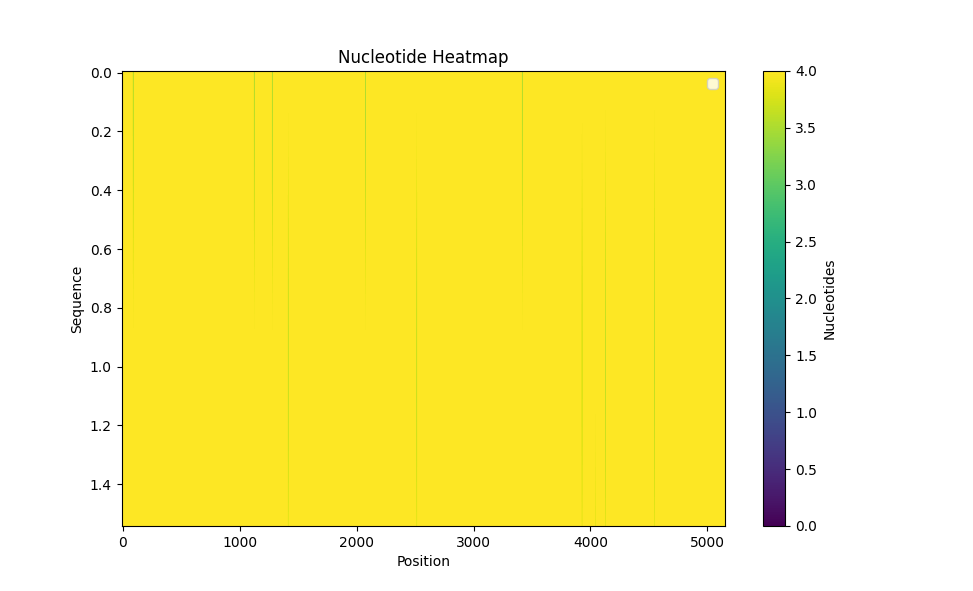
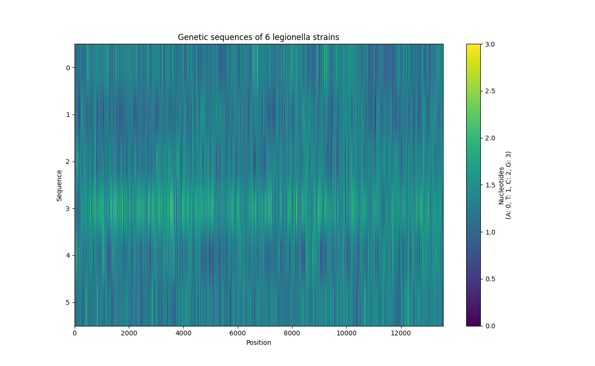
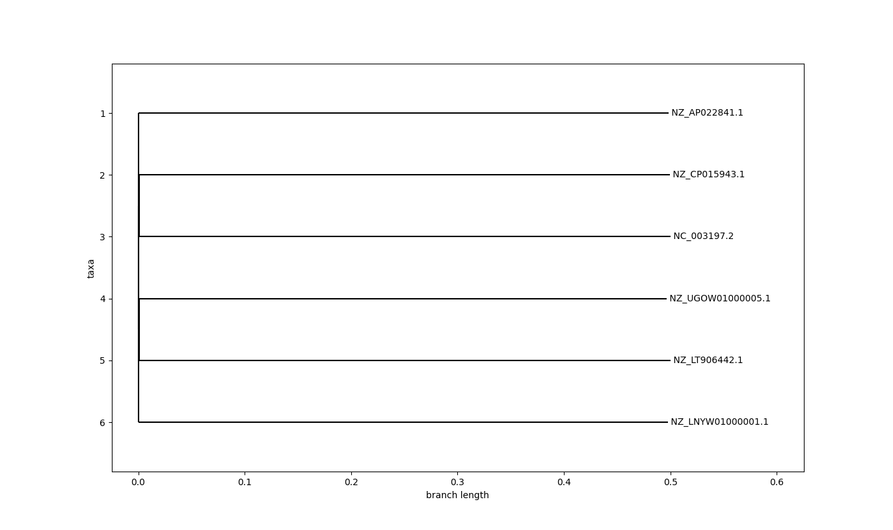
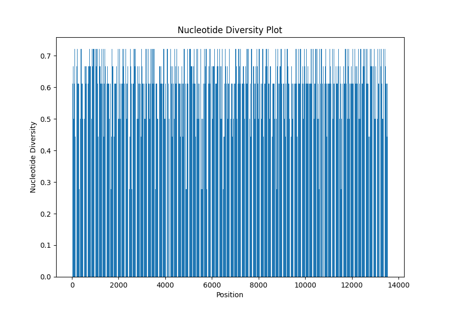

# Genetic diversity in legionella
Compairing genomes of different strains of legionella to count the diversity of this bacteria

## Introduction
The goal of this project was to study and understand the genetic diversity within a group of bacteria called Legionella. Genetic diversity refers to the differences in the genetic makeup of organisms within a particular group. In this case, I was interested in different strains of Legionella bacteria.

This project involved a few steps:
1. Data Collection - collecting bacterias DNA sequences of various strains of legionella 
2. Data Analysis - that is: MSA (multiple sequence-alignmnet)
3. Identifying genetic variations - I looked for specific genetic variations such as SNPs and indels
4. Constructing a phylogenetic tree - constructing a "familiy tree" of bacteria
5. Calculating genetic diversity - mathematical methods to findthe level of genetic diversity


## Data collection and analysis
I've collected genetic sequences of legionella sequences from NCBI (National Center for Biotechnology Information). It contains information of different bacteria, their DNA sequences (view legionella information <a href='https://www.ncbi.nlm.nih.gov/search/all/?term=legionella'>here</a>).

I've gathered sequences of 6 legionella strains:
- Legionella antarctica
- Legionella pneumophila
- Legionella quateirensis
- Salmonella enterica (belongs to the legionella family)
- Legionella shakespearei
- Legionella waltersii

<br>
Next, I had to create tools for data analysis to make MSA[0] possible. I analyzed the genetic data to align the sequences, which means putting them in order and comparing them with each other.

Then I used my own MSA algorythm, to:
1.  identify genetic differences such as Single-Nucleotide Polymorphisms (SNPs) and insertions/deletions (indels) by aligning sequences and highlighting variations at specific positions.
2. construct a phylogenetic tree, which visualizes the evolutionary relationships among different strains of Legionella (shows how the bacteria evolved).
3. analyze the aligned sequences, you can calculate genetic diversity indices such as nucleotide diversity

<br>
My algorythm is about 1,200 times faster than `MUSCLEv5` or `Clustalw2`. The alignment was visualized in this generated heatmap:




To make this possible, I had to retrive first x nucleotides in DNA sequences, so that I could operate on a constant number of nucleotides of each sequence (which in my case is 13556 nucleotides):
```python
retrived_nucleotides = bio_data_vis.retrive_first_nucleotides( file_path=r'./retrived_seqs.fna', n_nucleotides=13556 )
```

After retriving this data I can make MSAs:
```python

# bio_data_vis.py
def create_custom_msa_data( data : dict, n_nucleotides : int, out_file_name : str, file_type='fasta' ):

    aligned_seqs = []

    for nucleo, pos in data.items():
        sequence = [ '-' if i not in pos else nucleo for i in range( 1, n_nucleotides + 1 ) ]
        sequence = ''.join( sequence )
        seq_record = SeqIO.SeqRecord( Seq(sequence), id=nucleo )
        aligned_seqs.append( seq_record )

    
    SeqIO.write( aligned_seqs, out_file_name, file_type )
    
    return aligned_seqs


# main.py
aligned_seqs = bio_data_vis.create_custom_msa_data( bio_test_data, 13556, 'test_msa_file.fna' )
main_analysis.vis_heatmap_msa( aligned_seqs )           # after MSA

```


## Identifying genetic variations
Searching for SNPs[1] (known as single-nucleotide polymorphisms) and insertions or deletions in the genetic code (indels), can provide insights into how the bacteria have evolved over time.

By identifying SNPs in the genomes of various Legionella strains, you can pinpoint the exact locations where genetic variations occur. This information is crucial for understanding the genetic diversity and relatedness of different strains.

It is also essential, for constructing a phylogenetic tree for later. Here's a simple visualization of SNPs in all 6 strains:



The plot has been generated with this function:
```python

# bio_data_vis.py, Analysis
def vis_heatmap_snps( self, data : dict ):
        """
        :param data:    dictionary with sequences (Seq object in values);

        Note: all sequences should be the same length;
        """


        binary_sequences = []
        for seq in data.values():
            binary_seq = [ 0 if nt == 'A' else 1 if nt == 'T' else 2 if nt == 'C' else 3 if nt == 'G' else 4 for nt in seq ]
            binary_sequences.append( binary_seq )


        # print( f'binary_sequences:\n{binary_sequences}' )

        plt.imshow( binary_sequences, cmap='viridis', aspect='auto' )
        plt.colorbar( label="Nucleotides\n(A: 0, T: 1, C: 2, G: 3)" )
        plt.xlabel( "Position" )
        plt.ylabel( "Sequence" )
        plt.title( "Genetic sequences of 6 legionella strains before MSA" )

        plt.show()


        return binary_sequences

# main.py
main_analysis.vis_heatmap_snps( retrived_nucleotides )  # before MSA
```


## Constructing a phylogenetic tree

Also, phylogenetic tree helped us visualize how different strains are related to each other and how they've evolved. This tree was generated by `Clustalw2`:



To generate this tree, `.dnd` file is required which can be generated using `Clustalw2` and this code:
```python

# bio_data_vis.py
from Bio import Phylo

def generate_phylo_tree(self, read_dnd_file : str, file_type='newick'):
        """
        :param read_dnd_file: dnd file from MSA file;
        """

        tree = Phylo.read( read_dnd_file, file_type )

        fig, ax = plt.subplots( figsize=(10, 10) )
        Phylo.draw( tree, axes=ax, do_show=False )
        plt.show()


        return None

# main.py
main_analysis.generate_phylo_tree( 'to_align.dnd', 'newick' )

```

## Calculating genetic diversity
Calculating the genetic diversity allows us to understand how genetically different or similar these bacteria are. 

By quantifying genetic variation, you can uncover their evolutionary history and relationships.

High genetic diversity may indicate the presence of unique or outlier strains, which can be of particular interest for further investigation. A valid number of π (genetic diversity) somewhere between 0 and 1.

In essence, calculating genetic diversity helps characterize the genetic landscape of Legionella strains, providing a foundation for understanding their evolution, relatedness, and potential implications for public health.

I've generated a nucleotide diversity plot to quantify the level of genetic diversity:




The first steps to make this possible, was to:
```python
# 1. calculate nucleotide diversity

# bio_data_vis.py
def calc_nucleotide_diversity( self, data : dict, num_nt : int ) -> int:
        """
        """

        ls_nucleo_diversity = []
        num_seq = len( data )
        pi = 0

        for i in range( num_nt ):
            nucleotide_counts = {'A': 0, 'T': 0, 'C': 0, 'G': 0, 'N': 0, '-': 0, 'other': 0}

            for key in data:
                nucleotide = data[ key ][ i ]

                if ( nucleotide in nucleotide_counts ):
                    nucleotide_counts[ nucleotide ] += 1
            
            total_nucleotides = len(data)

            diversity = 1.0

            for nt, count in nucleotide_counts.items():
                freq = count / total_nucleotides
                diversity = diversity - freq**2

            ls_nucleo_diversity.append( diversity )

        # if (_DBG0_): print( f'nucleotide diversities:\n{ ls_nucleo_diversity }' )


        return ls_nucleo_diversity

# main.py
ls_nucleotide_diversity = main_analysis.calc_nucleotide_diversity( retrived_nucleotides, 13556 )


# 2. visualize on a generated bar chart
# bio_data_vis.py
def vis_genetic_diversity( self, diversities : list ):
        """
        """

        positions = range( 0, len( diversities ) )

        plt.bar( positions, diversities )
        plt.xlabel('Position')
        plt.ylabel('Nucleotide Diversity')
        plt.title('Nucleotide Diversity Plot')

        plt.show()

        return None

# main.py
main_analysis.vis_genetic_diversity( ls_nucleotide_diversity )
```


## Conclusion

The genetic diversity analysis of Legionella strains has provided valuable insights into their evolutionary history and genetic variations.

There will be some more tools added and taken away, to make this project even better.


## Notes and sources
[0] [Multiple sequence alignment - Wikipedia](https://en.wikipedia.org/wiki/Multiple_sequence_alignment)<br>
[1] [Single-Nucleotide Polymorphisms - Wikipedia](https://en.wikipedia.org/wiki/Single-nucleotide_polymorphism)<br>